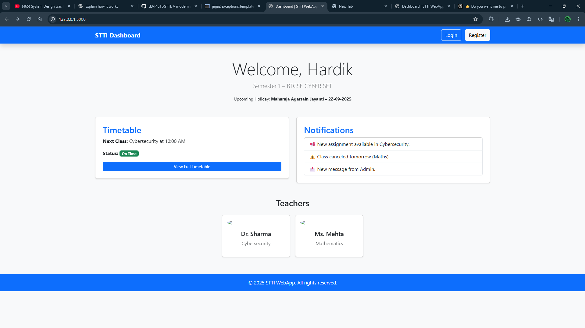
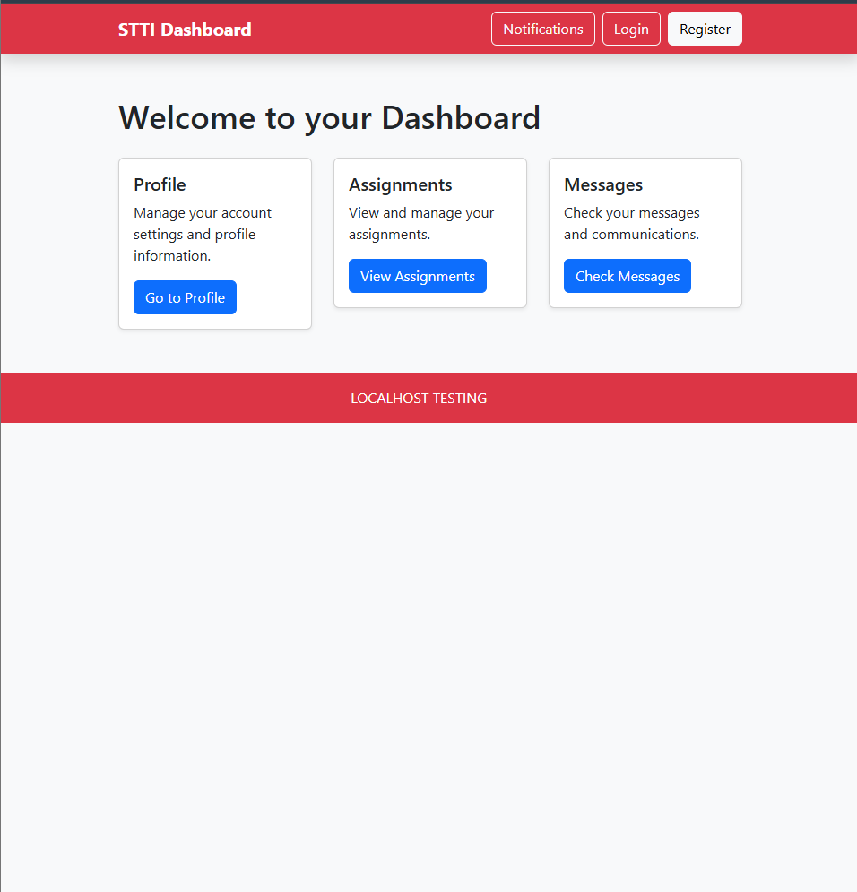
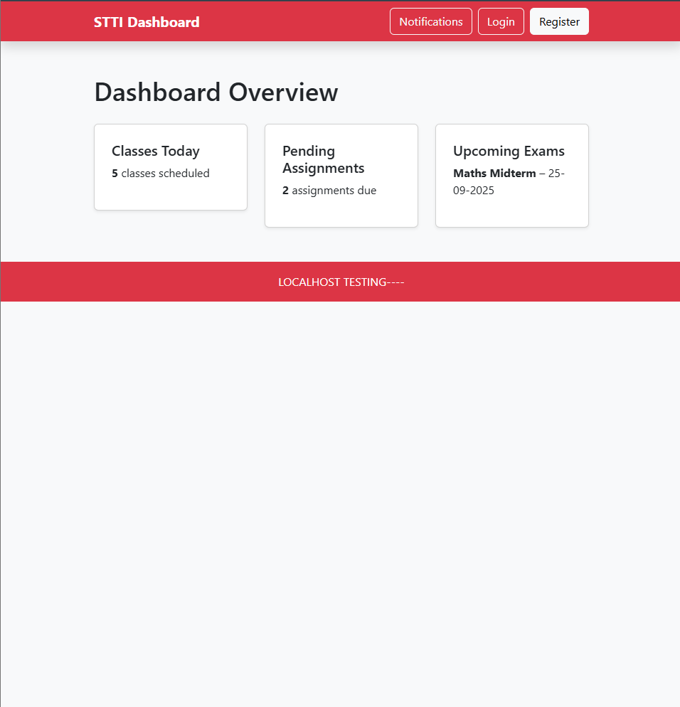
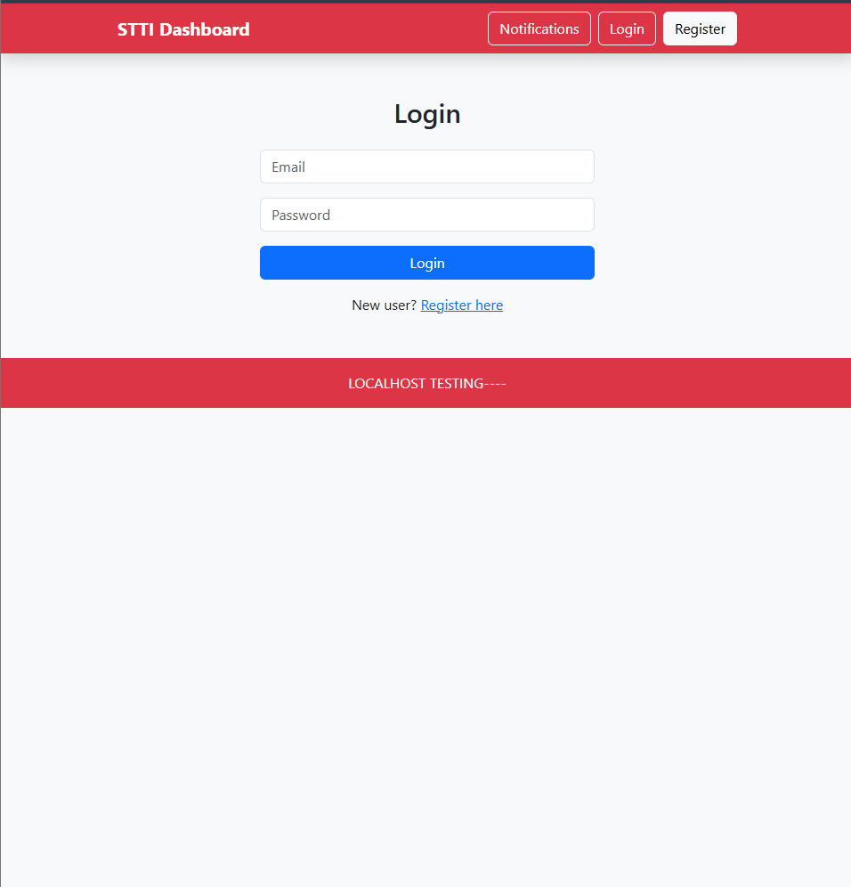
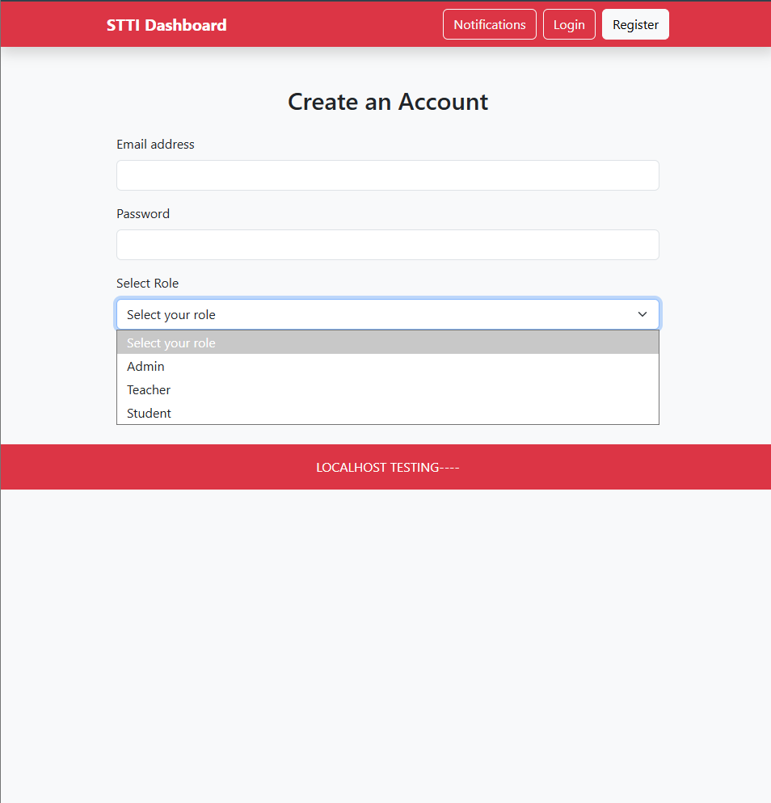

# STTI Web Application
STUDENT TEACHER TIME MANAGEMENT INTERFACE

A modern web application designed to manage student and teacher activities efficiently. Built using **Flask**, **HTML**, **CSS**, and **JavaScript**.

---

## Features (Implemented)
- Responsive and clean home page with Login & Register functionality
- Dashboard displaying relevant student and teacher data
- Notifications system for classes
- Timetable display with class status (Started / Delayed / Cancelled)
- Basic sidebar navigation for easy access to sections

---

## Planned Features
- Timetable creation algorithm
- Enhanced notification system with real-time updates
- Advanced analytics and reports
- Role-based access control for teachers and students
- Dynamic class management system

---

## Technologies Used
- Python (Flask)
- HTML5 / CSS3
- JavaScript (Vanilla JS)
- Bootstrap (for responsiveness)

---

## Project Structure
- `templates/` – HTML templates (home, dashboard, notifications, etc.)
- `static/` – CSS, JS, images
- `app/` – Flask app modules and routing
- `run.py` – Entry point to start the server

---

## Usage
1. Clone the repository  
   ```bash
   git clone https://github.com/d3-f4u1t/STTI.git


A modern web application designed to manage student and teacher activities efficiently. Built using **Flask**, **HTML**, **CSS**, and **JavaScript**.

---

## Features (Implemented)
- Responsive and clean home page with Login & Register functionality
- Dashboard displaying relevant student and teacher data
- Notifications system for classes
- Timetable display with class status (Started / Delayed / Cancelled)
- Basic sidebar navigation for easy access to sections

---

## Planned Features
- Timetable creation algorithm
- Enhanced notification system with real-time updates
- Advanced analytics and reports
- Role-based access control for teachers and students
- Dynamic class management system

---

## Technologies Used
- Python (Flask)
- HTML5 / CSS3
- JavaScript (Vanilla JS)
- Bootstrap (for responsiveness)

---

## Project Structure
- `templates/` – HTML templates (home, dashboard, notifications, etc.)
- `static/` – CSS, JS, images
- `app/` – Flask app modules and routing
- `run.py` – Entry point to start the server

---


## 1ST-TEST-BUILD:


## HOME-PAGE:


## LOGED-IN:


## LOGIN:


## REG:


## Usage
1. Clone the repository  
   ```bash
   git clone https://github.com/d3-f4u1t/STTI.git
